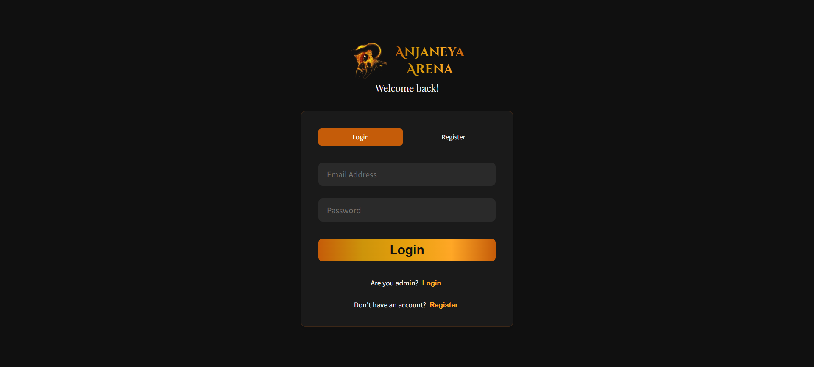
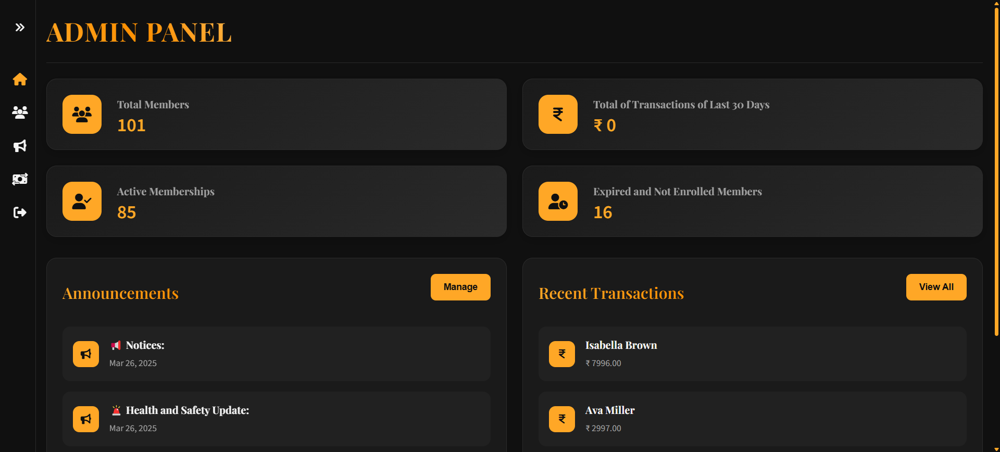
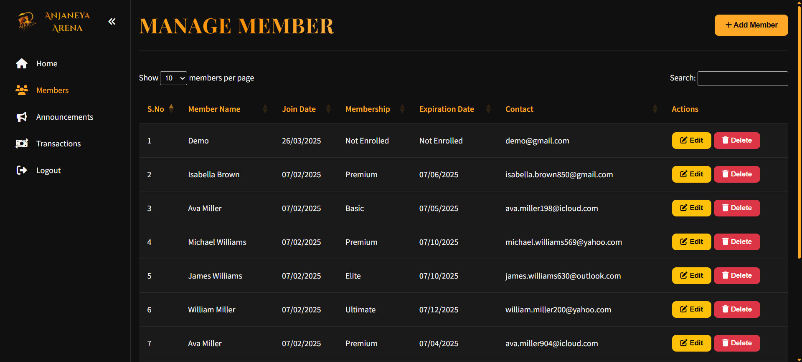
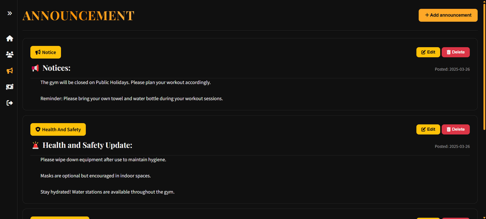
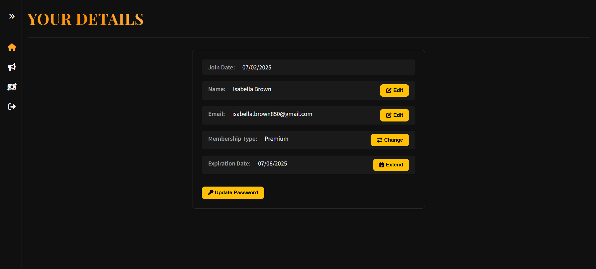

# Anjaneya Arena - Premium Fitness Center Management System 🏋️‍♂️💪

Anjaneya Arena is a web-based fitness center management system designed to streamline operations for gym administrators and provide a seamless experience for members. The system includes features for managing memberships, announcements, transactions, and user profiles.

🚀 **Live Demo**: [Anjaneya Arena](http://anjaneya-arena.devbyabhishek.infinityfreeapp.com/)

🔗 **LinkedIn Post**: [Check out the project on LinkedIn](#)

## Table of Contents
- [Features](#features)
  - [Admin Features](#admin-features)
  - [Member Features](#member-features-)
  - [General Features](#general-features)
- [Installation](#installation)
- [Usage](#usage)
  - [Admin Login](#admin-login)
  - [Member Registration](#member-registration)
- [Database Schema](#database-schema)
- [Technologies Used](#technologies-used)
- [Screenshots](#screenshots)
- [Project Structure](#project-structure)
- [Contact](#contact)

---

## Features✨

### Admin Features🏢
- **Dashboard**: View total members, active memberships, expired memberships, and recent transactions.
- **Manage Members**: Add, edit, and delete member details, including membership type and expiration date.
- **Announcements**: Create, edit, and delete announcements for gym events, updates, and notices.
- **Transaction History**: View all transactions with details like payment mode, membership changes, and total amount.

### Member Features 🏃‍♂️
- **Profile Management**: View and update personal details like name, email, and password.
- **Membership Management**: Upgrade or extend memberships with various payment options.
- **Transaction History**: View personal transaction history.

### General Features🌎
- **Authentication**: Secure login and registration for both members and admins.
- **Responsive Design**: Fully responsive UI for seamless use across devices.
- **DataTables Integration**: Interactive tables for managing members and transactions.

---

## Installation⚙️

1. **Clone the repository:**
   ```bash
   git clone https://github.com/Abhishek-soni6904/Anjaneya-Arena-GMS.git
   cd anjaneya_arena
   ```

2. **Set up the database:**
   - Import the `anjaneya_arena.sql` file into your MySQL database.
   - Update the database credentials in `require/config.php`.

3. **Start a local server:**
   - Use XAMPP, WAMP, or any PHP server to host the project.

4. **Access the application:**
   - Open your browser and navigate to `http://localhost/anjaneya_arena`.

5. **Note:**
   - Automatic Membership Expiration: If a membership expires, it is automatically updated to "expired" using MySQL events. If your hosting provider does not support events, uncomment the second line in manageMember.php to include require/cron.php. 
---

## Usage🛠️

### Admin Login🔑
1. Navigate to the login page (`login.php`).
2. Use the admin credentials (`admin/admin`) to log in.
3. Access the admin dashboard to manage members, announcements, and transactions.

### Member Registration📝
1. Navigate to the login page (`login.php`).
2. Switch to the registration tab and fill in the required details.
3. Log in with the registered credentials to access the profile and membership features.

---

## Database Schema🗂️

### Tables

#### `members`
Stores member details:
- `id` (INT, Primary Key, Auto Increment)
- `name` (VARCHAR)
- `membership_type` (ENUM: Basic, Premium, Elite, Ultimate, Expired)
- `email` (VARCHAR, Unique)
- `password` (VARCHAR)
- `join_date` (DATE, Default: Current Date)
- `expiration_date` (DATE, Nullable)

#### `announcements`
Stores announcements:
- `id` (INT, Primary Key, Auto Increment)
- `title` (VARCHAR)
- `category` (ENUM: Event, Equipment Update, Health and Safety, Notice, Achievement)
- `content` (TEXT)
- `created_at` (TIMESTAMP, Default: Current Timestamp)

#### `payments`
Stores transaction details:
- `id` (INT, Primary Key, Auto Increment)
- `memberId` (INT, Foreign Key References `members(id)`, On Delete Cascade)
- `action` (VARCHAR)
- `duration` (INT)
- `new` (VARCHAR)
- `changedFrom` (VARCHAR, Nullable)
- `payMode` (VARCHAR)
- `Total` (DECIMAL(10,2))
- `payDate` (TIMESTAMP, Default: Current Timestamp)

---

## Technologies Used🛠️

### Frontend🎨
- HTML
- CSS
- JavaScript
- DataTables

### Backend🖥️
- PHP

### Database🗄️
- MySQL

### Libraries📚
- Font Awesome (Icons)
- jQuery (DOM manipulation)
- DataTables (Interactive tables)

---

## Screenshots📸

### Home Page 🏠


### Login Page 🔐


### Admin Dashboard 📊


### Manage Members 🧑‍🤝‍🧑


### Announcements 📢


### Transactions 💰


### Profile Page 👤


---

## Project Structure📂

```
Anjaneya_Arena/
├── admin.php              # Admin dashboard
├── announcements.php       # Announcements management
├── index.php              # Landing page
├── login.php              # Login and registration page
├── manageMembers.php      # Member management page
├── profile.php            # Member profile page
├── transactions.php       # Transaction history page
├── assets/                # Static assets (images, videos)
│   ├── icon.png
│   ├── logo.png
│   ├── slider1.jpg
│   ├── slider2.webp
│   ├── slider3.jpeg
│   └── legacy_video.mp4
├── css/                   # Stylesheets
│   ├── admin.css
│   ├── announcements.css
│   ├── dashboard.css
│   ├── index.css
│   ├── login.css
│   ├── manageMember.css
│   ├── profile.css
│   └── transactions.css
├── js/                    # JavaScript files
│   ├── announcement.js
│   ├── dashboard.js
│   ├── index.js
│   ├── login.js
│   ├── manageMember.js
│   ├── profile.js
│   └── transactions.js
├── require/               # Backend logic
│   ├── announcementBack.php
│   ├── config.php
│   ├── cron.php
│   ├── loginBack.php
│   ├── logout.php
│   ├── manageMemberBack.php
│   ├── profileBack.php
│   └── sidebar.php
├── anjaneya_arena.sql     # Database schema
└── README.md              # Project documentation
```

---

## Contact📩
For any queries or support, feel free to reach out:
- **👤 Name**: Abhishek Soni
- **📧 Email**: abhisheksoni6904@gmail.com
- **🔗 GitHub**: [Abhishek-soni6904](https://github.com/Abhishek-soni6904)
- **📸 Instagram**: [\_abhishek.\_\.soni\_](https://www.instagram.com/_abhishek._.soni_/)
- **💼 LinkedIn**: [Abhishek Soni](https://www.linkedin.com/in/abhishek-soni-662028331/)
